-----

# 📚 Book Review App (Monorepo)

Este repositorio contiene dos proyectos interconectados:

1.  **`bookReview-app`**: Una aplicación móvil desarrollada con React Native (Expo) y TypeScript.
2.  **`firebase-server`**: El backend de Firebase (Emuladores y Cloud Functions) para gestionar la autenticación y, potencialmente, otras funcionalidades.

-----

## 🚀 Visión General del Proyecto

`bookReview-app` es una aplicación de revisión de libros que permite a los usuarios iniciar sesión, cerrar sesión y explorar una lista de libros. Se conecta a un API público de libros y utiliza Firebase (en modo emulador para desarrollo local y en la nube para producción) para la autenticación de usuarios.

`firebase-server` contiene la configuración de los emuladores de Firebase para el desarrollo local y las Cloud Functions que se desplegarán en Firebase Cloud en el futuro.

-----

## 📁 Estructura del Repositorio

```
.
├── bookReview-app/        # Proyecto de React Native (Expo)
│   ├── src/
│   │   ├── config/
│   │   │   └── firebase.ts
│   │   ├── navigation/
│   │   │   └── AppNavigator.tsx
│   │   ├── screens/
│   │   │   ├── HomeScreen.tsx
│   │   │   └── LoginScreen.tsx
│   │   └── services/
│   │       └── books.service.ts
│   ├── App.tsx
│   ├── metro.config.js
│   ├── package.json
│   └── tsconfig.json
│
├── firebase-server/       # Proyecto de Firebase (Emuladores y Functions)
│   ├── functions/
│   │   ├── src/           # Código fuente de tus Cloud Functions
│   │   └── package.json
│   ├── .firebaserc
│   ├── firebase.json
│   └── storage.rules
│
├── .gitignore             # Configuración global de Git
└── README.md              # Este archivo
```

-----

## 🛠️ Configuración Inicial del Proyecto

Sigue estos pasos para poner en marcha ambos proyectos en tu entorno de desarrollo.

### 1\. Requisitos Previos

Asegúrate de tener instalado lo siguiente:

  * **Node.js**: Versión 18 o superior.
  * **npm** (viene con Node.js) o **Yarn**.
  * **Expo CLI**:
    ```bash
    npm install -g expo-cli
    ```
  * **Firebase CLI**:
    ```bash
    npm install -g firebase-tools
    ```

### 2\. Configuración de `firebase-server` (Backend)

1.  **Navega al directorio de Firebase:**

    ```bash
    cd firebase-server
    ```

2.  **Inicia sesión en Firebase CLI:**
    Si es tu primera vez o si no has iniciado sesión recientemente:

    ```bash
    firebase login
    ```

3.  **Asocia tu proyecto de Firebase:**
    Si ya tienes un proyecto de Firebase en la nube, asegúrate de que el CLI esté asociado a él.

    ```bash
    firebase use --add
    ```

    Sigue las instrucciones para seleccionar o crear tu proyecto. Esto creará o actualizará el archivo `.firebaserc`.

4.  **Configura las reglas de Storage (si es necesario):**
    Asegúrate de que tu `storage.rules` esté configurado según tus necesidades para las pruebas locales.

5.  **Actualiza la IP del Host en `firebase.json`:**
    El archivo `firebase.json` configura los emuladores para que escuchen en una IP específica. **Debes cambiar la IP del host (`192.168.26.8`) a la IP local de tu máquina de desarrollo.** Esto es crucial para que tu aplicación móvil pueda conectarse a los emuladores.

      * **Para encontrar tu IP local:**

          * **Windows:** Abre el Símbolo del Sistema o PowerShell y escribe `ipconfig`. Busca tu "Dirección IPv4" (ej. `192.168.1.XX` o `10.0.0.XX`).
          * **macOS/Linux:** Abre la Terminal y escribe `ifconfig` o `ip addr`. Busca tu dirección `inet` para tu interfaz de red activa (generalmente `en0` o `wlan0`).

      * Una vez que tengas tu IP, abre `firebase-server/firebase.json` y reemplaza todas las instancias de `192.168.26.8` con tu IP local.

    **Ejemplo (reemplazando `TU_IP_LOCAL`):**

    ```json
    {
      "functions": [
        ...
      ],
      "storage": {
        "rules": "storage.rules"
      },
      "emulators": {
        "auth": {
          "port": 9099,
          "host": "TU_IP_LOCAL"
        },
        "functions": {
          "port": 5001,
          "host": "TU_IP_LOCAL"
        },
        "firestore": {
          "port": 8080,
          "host": "TU_IP_LOCAL"
        },
        "storage": {
          "port": 9199,
          "host": "TU_IP_LOCAL"
        },
        "ui": {
          "enabled": true,
          "port": 9005,
          "host": "TU_IP_LOCAL"
        },
        "singleProjectMode": true
      }
    }
    ```

7.  **Inicia los emuladores de Firebase:**
    Desde el directorio `firebase-server/`, ejecuta:

    ```bash
    firebase emulators:start
    ```

    Esto levantará los servicios de Authentication, Functions, Firestore y Storage en tu máquina local. Podrás acceder a la UI del emulador en `http://TU_IP_LOCAL:9005`.
    **Nota:** Crea al menos un usuario de prueba en la UI del emulador de Authentication para poder iniciar sesión desde la aplicación.

### 3\. Configuración de `bookReview-app` (Frontend)

1.  **Navega al directorio de la aplicación:**

    ```bash
    cd ../bookReview-app
    ```

2.  **Instala las dependencias:**

    ```bash
    npm install
    # o si usas yarn: yarn install
    ```

3.  **Configura `src/config/firebase.ts`:**
    Este archivo contiene la configuración para que tu aplicación se conecte a Firebase.

      * **Credenciales del proyecto en la nube:** Copia los valores `apiKey`, `authDomain`, `projectId`, `storageBucket`, `messagingSenderId`, `appId` y `measurementId` desde la configuración de tu proyecto en la [Consola de Firebase](https://console.firebase.google.com/). Estos son necesarios para inicializar la app de Firebase, incluso cuando usas emuladores.
      * **IP del emulador local:** Al igual que en `firebase.json`, **debes actualizar la IP del host en las llamadas a `connectAuthEmulator`, `connectFirestoreEmulator`, etc.** Reemplaza `127.0.0.1` (o la IP que tuvieras) con la misma **IP local de tu máquina** que usaste en `firebase.json`.

    **Ejemplo (reemplazando `YOUR_...` con tus datos y `TU_IP_LOCAL`):**

    ```typescript
    // src/config/firebase.ts
    import { initializeApp } from 'firebase/app';
    import { getAuth, connectAuthEmulator } from 'firebase/auth';
    import { getFirestore, connectFirestoreEmulator } from 'firebase/firestore';
    import { getStorage, connectStorageEmulator } from 'firebase/storage';
    import { getFunctions, connectFunctionsEmulator } from 'firebase/functions';

    const firebaseConfig = {
      apiKey: "YOUR_API_KEY",
      authDomain: "YOUR_PROJECT_ID.firebaseapp.com",
      projectId: "YOUR_PROJECT_ID",
      storageBucket: "YOUR_PROJECT_ID.appspot.com",
      messagingSenderId: "YOUR_MESSAGING_SENDER_ID",
      appId: "YOUR_APP_ID",
      measurementId: "YOUR_MEASUREMENT_ID"
    };

    const app = initializeApp(firebaseConfig);

    const auth = getAuth(app);
    const db = getFirestore(app);
    const storage = getStorage(app);
    const functions = getFunctions(app);

    // Conecta a los emuladores SOLO en entorno de desarrollo
    if (__DEV__) {
      try {
        console.log("Conectando a Firebase Emulators...");
        connectAuthEmulator(auth, "http://TU_IP_LOCAL:9099");
        connectFirestoreEmulator(db, "TU_IP_LOCAL", 8080);
        connectStorageEmulator(storage, "TU_IP_LOCAL", 9199);
        connectFunctionsEmulator(functions, "TU_IP_LOCAL", 5001);
        console.log("Conectado a Firebase Emulators.");
      } catch (e) {
        console.error("Error al conectar a los emuladores de Firebase:", e);
      }
    } else {
      console.log("Usando Firebase en la nube.");
    }

    export { app, auth, db, storage, functions };
    ```

4.  **Inicia la aplicación Expo:**
    Desde el directorio `bookReview-app/`, ejecuta:

    ```bash
    npx expo start -c
    ```

    El flag `-c` es importante para limpiar la caché de Metro y asegurar que los cambios de configuración se apliquen.
    Esto abrirá la Expo Dev Tools en tu navegador. Desde ahí, puedes:

      * Escanear el código QR con la aplicación Expo Go en tu teléfono.
      * Ejecutar en un simulador de iOS o un emulador de Android.

-----

## ✅ Uso de la Aplicación

1.  **Inicia sesión** con el usuario que creaste en la UI del emulador de Firebase Authentication.
2.  Una vez autenticado, la aplicación te redirigirá a la pantalla de **Home**, donde verás la lista de libros cargados desde el API de Udacity.
3.  Puedes **cerrar sesión** desde la pantalla de Home.

## 📸 Capturas de pantalla

#### Inicio de sesión
<p float="left">
  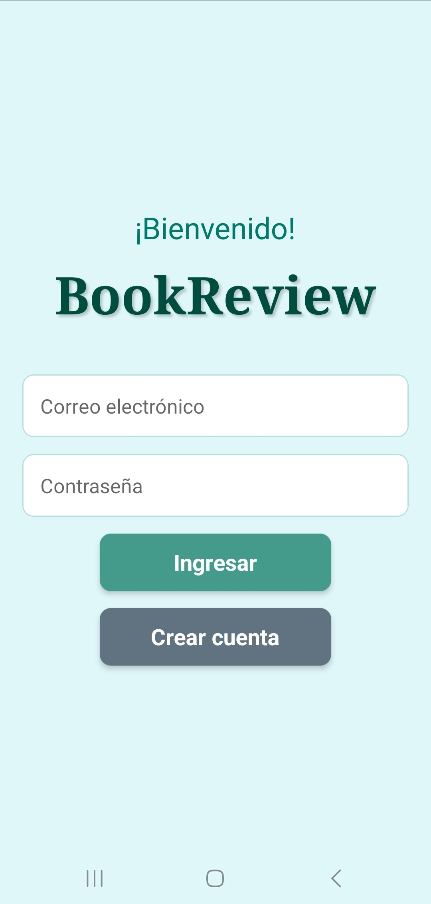
  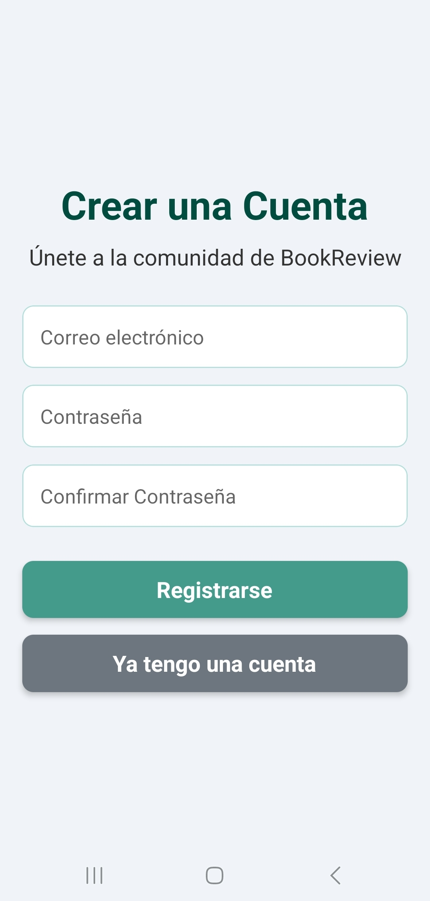
</p>

#### Home y búsqueda
<p float="left">
  
  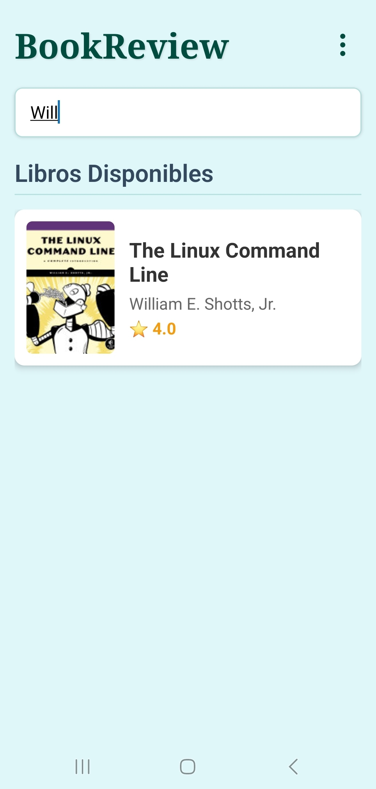
  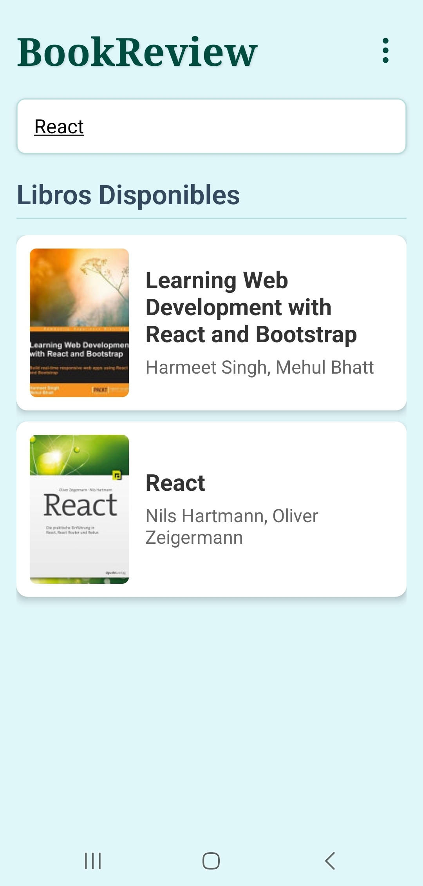
</p>

#### Detalle de libro
<p float="left">
  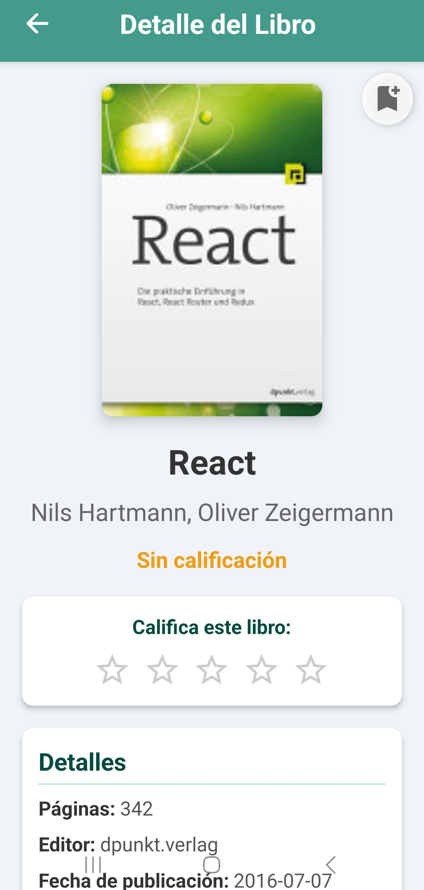
  
  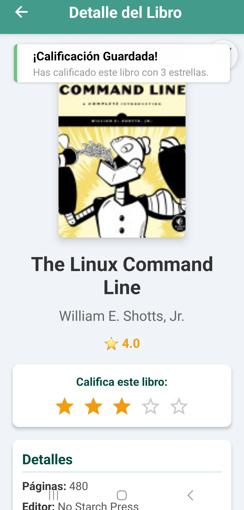
</p>

#### Perfil
<p float="left">
  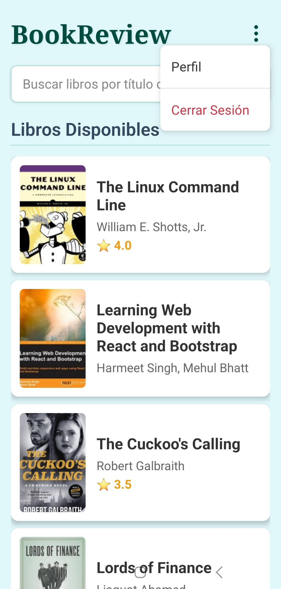
  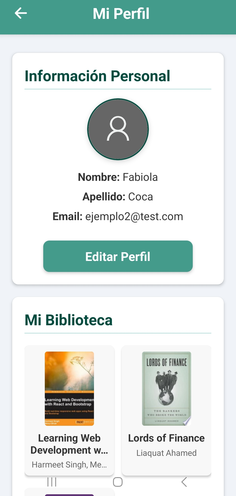
</p>

#### Editar perfil y foto
<p float="left">
  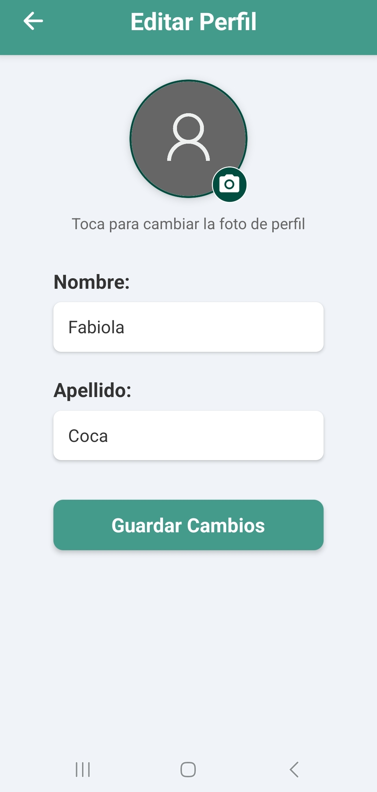
  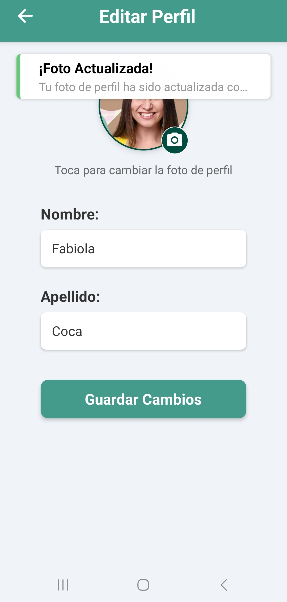
  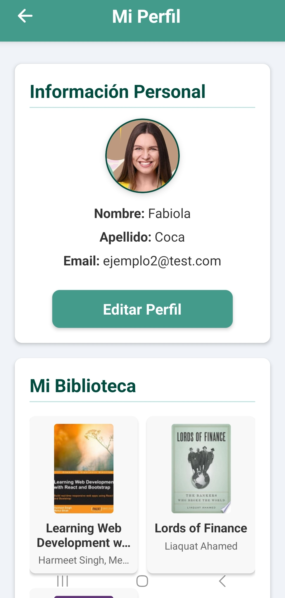
</p>